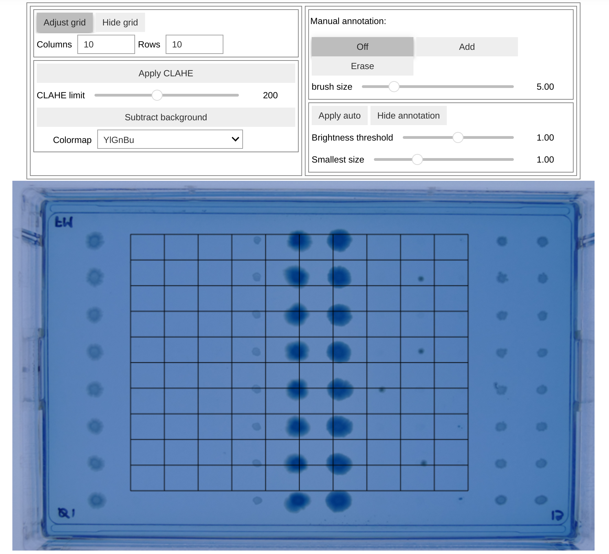
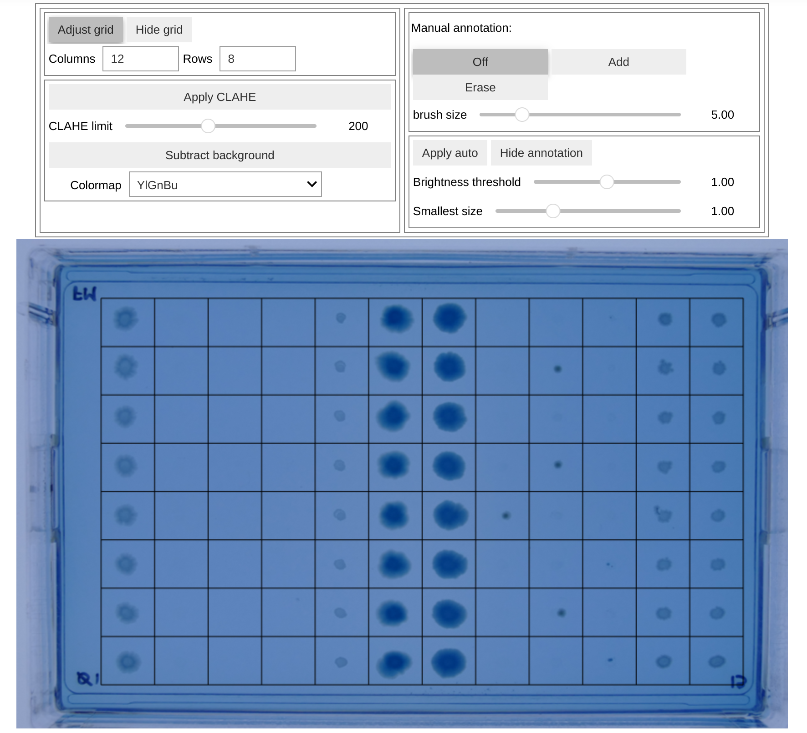

# Grid System

BactoVision's grid system is a powerful feature that allows you to analyze bacterial growth in a structured, quantitative manner across different regions of your image.

## Overview

The grid system divides your image into a customizable array of cells, enabling:

- Systematic comparison of bacterial growth across different regions
- Quantitative analysis of growth density in each grid cell
- Structured data extraction for statistical analysis

## Basic Grid Concepts

A grid in BactoVision consists of:

- A configurable number of horizontal (X) and vertical (Y) divisions
- Adjustable padding around the edges
- Automatic calculation of metrics for each grid cell

## Configuring the Grid

### Using the UI Controls

The grid can be configured using the grid controls in the top left section. Click Adjust Grid to activate the corresponding mode. If you initialize the widget without providing grid_config, this mode is active by default:


```python
from bactovision import BactoWidget

widget = BactoWidget('path/to/image.png')
widget
```
{align=center width=700}

This view with `Adjust grid` activated allows you to first the set the correct
grid by providing the correct numbers for `Columns` and `Rows` in the widget and
dragging the edges of the grid manually to set the correct padding.

{align=center width=700}

After the correct grid is set, click `Adjust grid` to leave this mode.
As a result, the widget will show the cropped version.

{align=center width=700}


### Save and load grid configuration

Once the grid is set, you can save it and then reuse on other images with the same geometry:

```python
# Save the grid configuration
widget.save_grid_config('grid_config.json')

# Or get grid config as an object
grid_config = widget.get_grid_config()

# ...

# Create new widget with another image
# and the same grid config

widget = BactoWidget('path/to/image.png', grid_config='grid_config.json')

# or

widget = BactoWidget('path/to/image.png', grid_config=grid_config)
```

## Grid-Based Analysis

Once your grid is configured and [Annotation](Annotation) is complete, BactoVision can calculate various [Metrics](metrics.md) for each grid cell.
